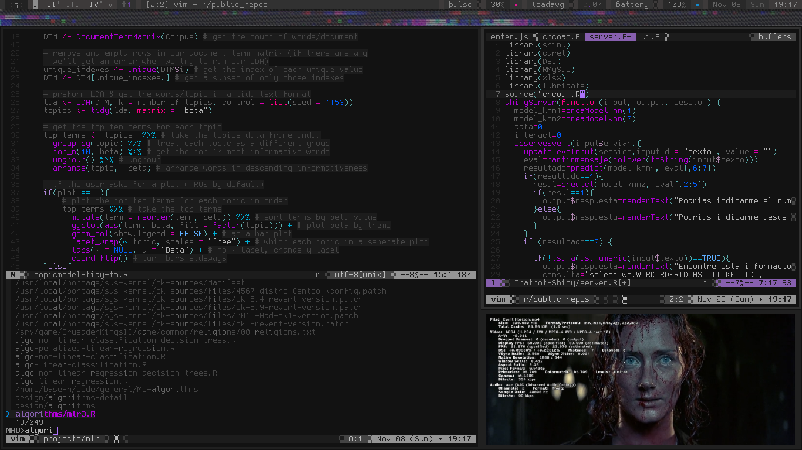
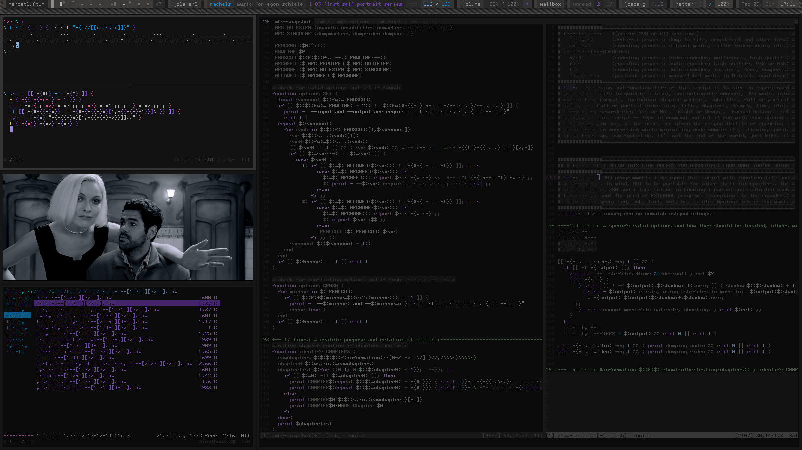

Current Setup:
--------------

+ *DISTRO* = Gentoo ( ~amd64 nomultilib )

+ *KERNEL* = GNU/Linux 5.9.9 ( CK/MuQSS, GCC -03, full built-in, etc. )

+ *INIT* = OpenRC ( sysvinit )

+ *SHELL* = zsh

+ *EDITOR* = vim

+ *TERMINAL MULTIPLEX* = tmux

+ *MEDIA PLAYER* = mpv

+ *X WINDOW MANAGER* = herbstluftwm

+ *X TERMINAL EMULATOR* = st

+ *X IMAGE VIEWER* = sxiv

+ *X READER* = mupdf

+ *X WEB BROWSER* = IceCat

Screenshots:
--------------

Currently:

Previously:

